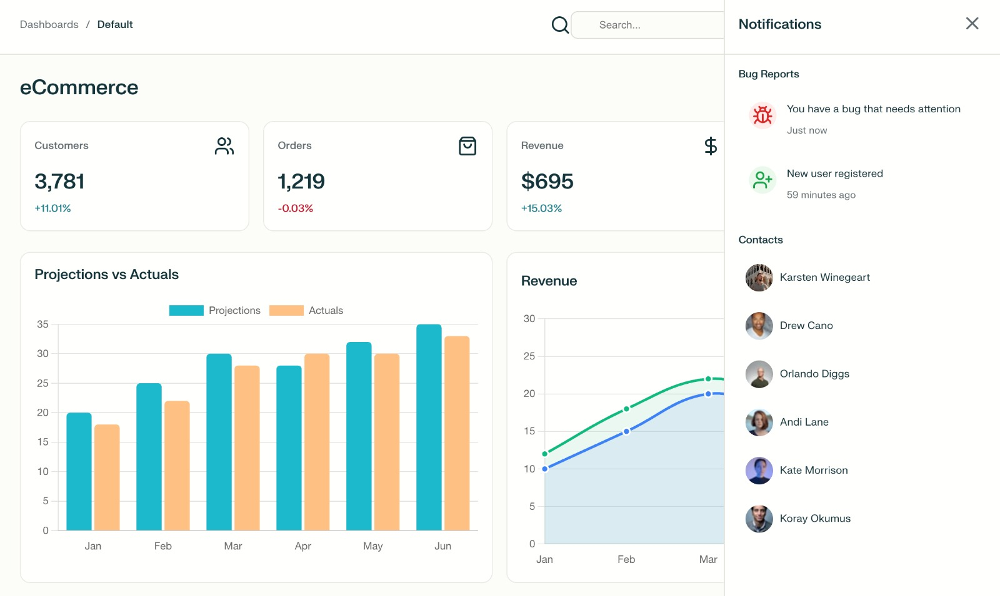

# Dashboard

A pixel-perfect, responsive React dashboard application featuring dark/light themes, interactive data visualization, and enterprise-level UI components. 

# ✨ Features

## 🎨 Modern UI/UX

- Pixel-perfect design implementation

- Dark/Light theme toggle with smooth transitions

- Responsive design (Mobile, Tablet, Desktop)

- Professional color palette and typography

- Smooth animations and micro-interactions

- Loading states and error boundaries

## 📊 Data Visualization
- Interactive charts powered by Chart.js

- Real-time metrics with animated counters

- Multiple chart types: Line, Bar, Donut, Area

- Responsive charts that adapt to screen size

- Hover tooltips with detailed information

- Revenue tracking and performance analytics

## 🏗️ Advanced Components
- Collapsible sidebar navigation

- Sortable data tables with pagination

- Search and filter functionality

- Status badges with color coding

- User avatars and profile management

- Notification system with real-time updates

## ⚡ Performance & Quality
- Fast loading (< 2 seconds)

- Zero JavaScript errors

- Cross-browser compatibility

- Accessibility compliant (WCAG 2.1 AA)

- SEO optimized

- Mobile-first approach

# 🖥️ Screenshots

## Light Theme - Dashboard

## Dark Theme - Dashboard

## Orders Management

## Mobile Responsive

## Notifications

## 🛠 Tech Stack
### React 18 
- Modern component architecture with hooks

### React Router DOM 6.x 
- Client-side routing for SPA navigation

### Chart.js 4.2.1 
- Interactive data visualization

### Lucide Icons 
- Consistent iconography system

### JavaScript ES6+ 
- Modern language features

### CSS3 
- Grid, Flexbox, Custom Properties, Animations

### HTML5 
- Semantic markup with accessibility

# 🚀 Quick Start
## Prerequisites
- Modern web browser (Chrome, Firefox, Safari, Edge)

## Installation
### 1-Clone the repository

### bash
git clone https://github.com/SunilKumarSharma129/Dashboard.git

cd  Dashboard

### 2-Open the project

- No build process required - open directly in browser
- open index.html

 
### 3-Access the application

- Direct: Open index.html in your browser

# 📱 Usage
## Navigation
- Use the sidebar to navigate between Dashboard and Orders pages

- Collapse/expand sidebar using the hamburger menu

- Theme toggle in the top navigation switches between light/dark modes

## Dashboard Features
- KPI Cards: View key business metrics with change indicators

- Interactive Charts: Hover for detailed tooltips and data points

- Revenue Tracking: Monitor performance across different time periods

- Top Products: Analyze best-selling items with sortable data

## Orders Management
- Search orders using the search bar

- Sort columns by clicking column headers

- Filter by status using status badges

- Navigate pages using pagination controls

## Responsive Design
- Desktop: Full feature set with expanded sidebar

- Tablet: Optimized layout with collapsible sidebar

- Mobile: Touch-friendly interface with hamburger menu

# 🔧 Browser Support
 
- Chrome	 
- Firefox	 
- Safari	 
- Edge	 
- Mobile Browsers

## Author

- [@SunilKumarSharma129](https://github.com/SunilKumarSharma129)

